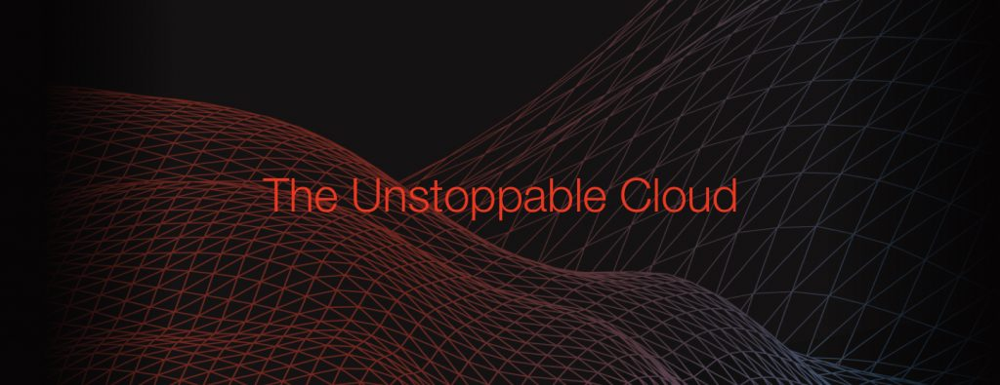

# AkashFinTechCaseStudy
Akash Case Study

**Overview - The protocol Akash is a censorship-resistant, permission-less and self-sovereign, faster, more efficient, and lower cost cloud built for DeFi, decentralized projects, and high growth companies, providing unprecedented scale, flexibility and price performance. Up to 10x lower in cost, the serverless computing platform is compatible with all cloud providers and all applications that run on the cloud. Akash network is the first disrupter in the cloud storage area of its kind.**

* Akash Network

* May 13, 2018 is when the whitepaper and idea for Akash were born, the went live on 20 Feb 2021.

* Greg Osuri (CEO) Adam Bozanich (CTO) Boz Menzalji (COO). the team consists of Maly Ly (CGO) Cheng Wang (CFO) Michael Gushansky (SGMM) Artur Troian (SSE) Olive Kimoto (CCM) Ryan Sumpter (DRE) Eric Urban (DSE) Kelsey Ruiz (HOC) Steph Bernstein (F&OM) Andrii Hnatiuk (RussianCM) Alex Wang (ChineseCM)

* The idea for Akash came about from the team who were already involved in the cloud computing space with AWS and google cloud etc, they noticed short falls throught the entire system with 70% of the total market share being controlled by the big 3x, causing developers high and/or set fee's with no competitors in sight, and the limited potential of flexability, usability and costs of wanting to transfer your developments to a different cloud provider.

* The Company is funded by its native token AKASH (AKT) with the total current market cap of $320,247,482.

## Business Activities:

* The foundational design objective of the Akash Network is to maintain a low barrier to entry for providers while at the same time ensuring that clients can trust the resources that the platform offers them. To achieve this, the system requires a publicly-verifiable record of transactions within the network. To that end, the Akash Network is implemented using blockchain technologies as a means of achieving consensus on the veracity of a distributed database.

* Anyone wanting to achieve the follwong may be clients using Akash because of its cost advantage, usability, and flexibility to move between cloud providers, and the performance benefits of global deployments. Providers use Akash because it allows them to earn profits from either dedicated or temporarily-unused capacity. Is there any information about the market size of this set of customers? The Cloud Computing market is set to hit $737 Billion, with 53% of global internet traffic out of which Amazon, Google, and Microsoft will deliver 80% of the payload.

* Akash is a cloud platform for real-world applications. The requirements of such applications include: Many workloads deployed across any number of datacenters. Connectivity restrictions which prevent unwanted access to workloads. Self-managed so that operators do not need to constantly tend to deployments.
To support running workloads on procured resources, Akash includes a peer-to-peer protocol for distributing workloads and deployment configuration to and between a client’s providers. Workloads in Akash are defined as Docker containers. Docker containers allow for highly-isolated and configurable execution environments, and are already part of many cloud-based deployments today.

* Which technologies are they currently using, and how are they implementing them? (This may take a little bit of sleuthing–– you may want to search the company’s engineering blog or use sites like Stackshare to find this information.)
*BLOCKCHAIN - The Akash blockchain provides a layer of trust in a decentralized and trustless environment. Clients inherently trust today’s large infrastructure Providers based primarily on the brand equity they’ve built over years.Akash does not and should not require that same leap of faith, since any Provider with capacity can compete to offer services on Akash. Instead, the blockchain earns trust via an open and transparent platform. Data on the chain is an immutable and public record of all transactions, including each Provider’s fulfillment history. Akash is also politically decentralized. No single entity controls the network and no intermediary facilitates transactions. Therefore no entity is incentivized to control or to extract marginal revenue from the network
*THE AKASH TOKEN - The Akash Token (AKASH) is used to simplify the exchange of value and align economic incentives with proper user behavior. The Akash
token is the marketplace currency used to pay for leased compute infrastructure on Akash’s decentralized network. the token serves two primary functions in Akash’s ecosystem, staking and global payments.

## Landscape:

* Cloud Computing Domain.

* By 2010, the three cloud giants—Amazon Web Services, Microsoft, and Google—had all launched their cloud businesses. It was also the year that saw the birth of OpenStack, the leading open-source cloud software platform. Worldwide spending on public cloud started the decade at $77 billion, according to Statista, and was projected to finish it at $411 billion—more than five times that amount. Realizing the scalability and elasticity of cloud services requires that cloud environments are defined by code. AWS CloudFormation, launched in 2011, brought a supported, consistent way of defining AWS cloud deployments to environments of all sizes. The past decade has seen the rise of born-in-the-cloud companies. From video streaming to ride sharing services, these companies were able to move faster and more cheaply than if they had started their businesses 15 years ago, observed Linthicum, all thanks to cloud computing.

* Competitors - Amazon Web Services, Google, Microsoft.

## Results

* What has been the business impact of this company so far?

* What are some of the core metrics that companies in this domain use to measure success? How is your company performing, based on these metrics?

* How is your company performing relative to competitors in the same domain?

## Recommendations

* If you were to advise the company, what products or services would you suggest they offer? (This could be something that a competitor offers, or use your imagination!)

* Why do you think that offering this product or service would benefit the company?

* What technologies would this additional product or service utilize?

* Why are these technologies appropriate for your solution?
